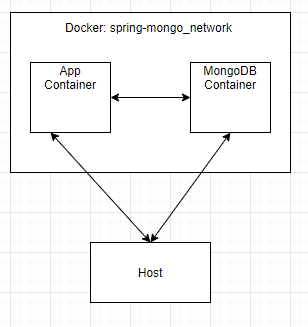
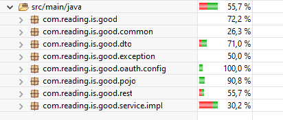

# readingisgood

*by Nalan Ekici*

**Note** This documentation is about technologies and project structure, project build operation, and general information.

**Tech Stack**

Install java 11 [https://openjdk.java.net/projects/jdk/11/](https://openjdk.java.net/projects/jdk/11/) 

Install maven [https://maven.apache.org/](https://maven.apache.org/)

Install mongodb or use online mongodb

**Project Structure**

**1** The user will be able to add new book on the system

**2** The user will be able to add new customer on the system

**3** The user will be able to create order on the system

**4** The user will be able to query all customer information with pagination

**5** The user will be able to query order with order id

**6** The user will be able to query order between date interval

**7** The user will be able to see their own monthly statistics

**8** The user will be able to use only one time to register on the system

**Docker Structure**

**Note:** Best practice is that closing the database connection for accessing from host.

**How to run the project on docker container**

**1** Open command shell on the main project.

**2** run **"docker compose build"** on the shell

**3** run **"docker compose up"** on the shell

**Note** Firstly you have to install docker on your computer. You can use below link to learn "how to install docker"

for windows [https://docs.docker.com/desktop/windows/install/](https://docs.docker.com/desktop/windows/install/)

for mac [https://docs.docker.com/desktop/mac/install/](https://docs.docker.com/desktop/mac/install/)

for linux [https://docs.docker.com/engine/install/](https://docs.docker.com/engine/install/)

**General Information**

**1** You can use swagger to see details of requests

**2** You can find postman export into **"/docs/Postman"** folder

**3** Client Credential is used for authentication. You can find credential information into Postman export.

**4** Unit test coverage is 55.7%

